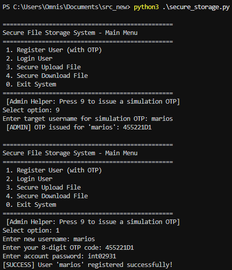
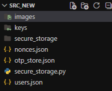
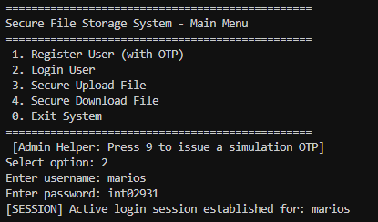
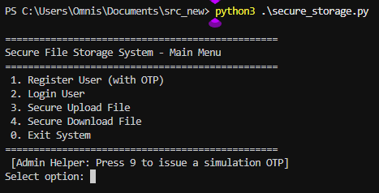
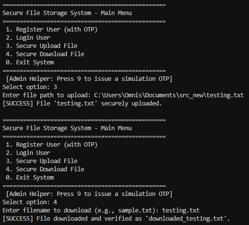
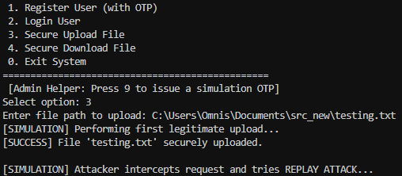

# 2nd Assignment: Secure File Storage System
**Course:** Information Systems Security  
**University:** University of Ioannina - Department of Informatics & Telecommunications  
**Name/Surname:** Marios Grivas
**ID:** 2931
**EMAIL:** int02931@uoi.gr


## 1. Introduction
This report documents the implementation of a secure command-line file storage system developed in Python. The application integrates essential cryptographic principles to ensure confidentiality, integrity, authenticity, and non-repudiation for stored items, while defending against common network and application-level attacks.


## 2. System Architecture & Core Modules

### Part A: Hash & Salt (Credential Storage)
The system reuses password-hashing concepts by combining a cryptographically secure 16-byte random salt with the user's plaintext password. The composite structure is iteratively hashed using the SHA-256 algorithm via Python's standard hashlib library. This architecture prevents pre-computation strategies like Rainbow Table attacks and mitigates standard brute-force vectors.

### Part B: One-Time Password (OTP) & Registration
To strictly authorize account creation, an administrator must issue an 8-digit hexadecimal single-use token via the terminal interface. During registration, the application loads the OTP database, performs case-insensitive verification, ensures the token has not been previously consumed, marks it as used, records the credentials in the user database, and triggers public/private RSA key generation.

### Part C: Defense-in-Depth Authentication
User login mandates loading credential records from the user database. The verification routine leverages the stored hash and unique salt parameters. To prevent user-enumeration side-channel vulnerabilities, the module surfaces a generic error notification regardless of whether the username is missing or the password string is incorrect.

### Part D: Public-Key Cryptography (RSA Keys)
Upon successful user sign-up, the system automatically spawns an asymmetric RSA-2048 key pair. The asymmetric objects are exported into traditional OpenSSL format PEM payloads within a protected local directory. Private keys are utilized for generation of identities, and public keys are bound to identity verification.

### Part E: Anti-Replay Validation (Nonces)
To provide resistance against message replay exploitation, every structural file operation creates an ephemeral 16-byte cryptographically random identifier known as a nonce. Incoming request tokens are cross-referenced against an ongoing index array stored inside the nonce database. Duplicate identifiers trigger terminal system alerts and terminate processing immediately.

### Part F: Cryptographic Pipeline (AES-256-GCM & RSA-PSS)
* **Symmetric Encryption (AES-256-GCM):** Data files are symmetrically processed using authenticated encryption, generating an arbitrary 32-byte key along with a 12-byte initialization vector per operation to ensure absolute privacy and payload preservation.
* **Asymmetric Signatures (RSA-PSS):** Data buffers are combined with active request nonces and digitally signed using the uploader’s individual RSA private key paired with RSA-PSS padding and SHA-256 digests.

### Part Z: Complete Pipeline Integration & Interface
The CLI loop establishes strict access control parameters. Options like secure upload and download demand a validated, running session identifier. Metadata, encryption parameters, and raw binary components are safely encoded into standardized Base64 formats to support flat file storage inside JSON layouts.


## 3. Screenshots & Verification Checkpoints

### 3.1 OTP User Register
> ****
-  *Description:* Displays the registration of the user.

### 3.2 Admin OTP Issuance & User Registration
> **** >
-  *Description:* Displays the generation of the images created.

### 3.3 Secure Login Session
> **** >
-  *Description:* Demonstrates a successful user authentication instance updating the CLI global runtime state variables.

### 3.4 CLI Interface - Menu
> **** >
- *Description:* Menu in the command line interface.

### 3.5 Cryptographic Download/Upload & Signature Validation
> **** >
-  *Description:* Demonstrates running the download/upload option to parse encrypted storage, perform symmetric recovery, authenticate authorship via public RSA keys, and map local extractions.

### 3.6 Replay Attack Interception
> **** >
-  *Description:* Captures the terminal output executing the integrated simulation workflow, where a duplicate request nonce is detected within the database, prompting a direct application abort to safeguard the storage pipeline.

### File Structure
```
Assignment_2_2931.zip
│
├── secure_storage.py
└── REPORT.md
```
